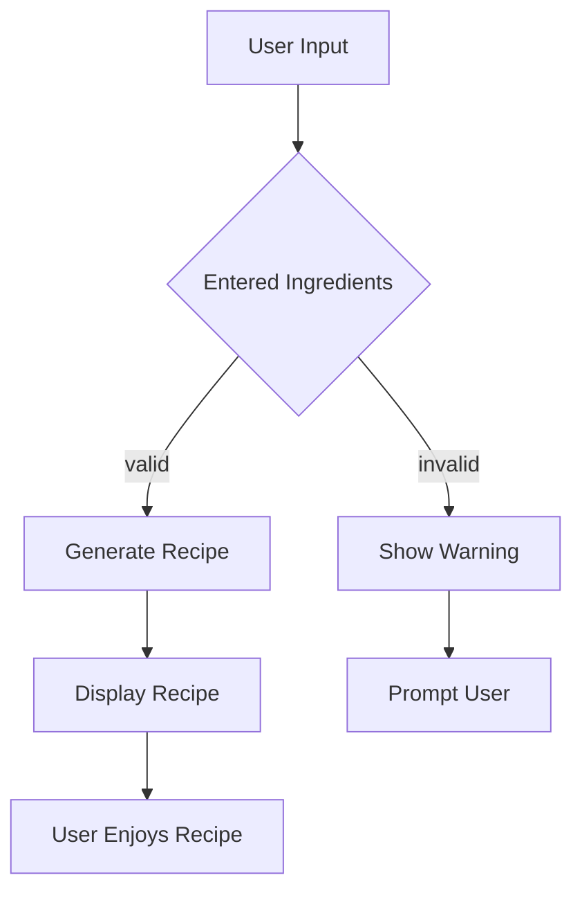

# Recipe Generator

## Project Overview
This application generates recipe ideas based on a list of ingredients input by the user.

## Installation Instructions
1. Clone the repository:
    ```
    git clone <repository_url>
    cd Recipe-Generator
    ```
2. Install required dependencies:
    ```
    pip install -r requirements.txt
    ```

## Steps to Run the App
1. Ensure you have Python installed (preferably Python 3.7+).
2. Run the application:
    ```
    streamlit run recipe-generator.py
    ```
3. Open your browser and go to the URL shown in the terminal.

## Additional Information
- Full implementation requires the use of Anthropic's Claude API.
- To connect with Claude, get your API key and set it in your environment variables.

## Architecture


## License
This project is licensed under the MIT License.
